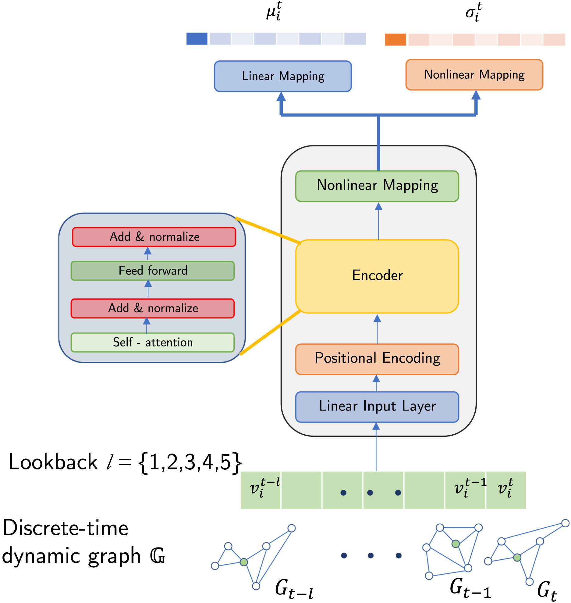
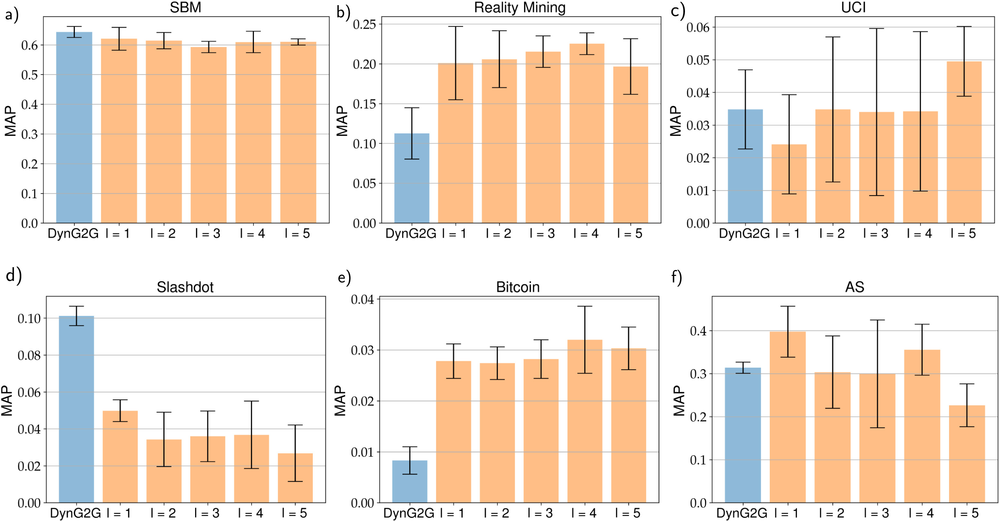
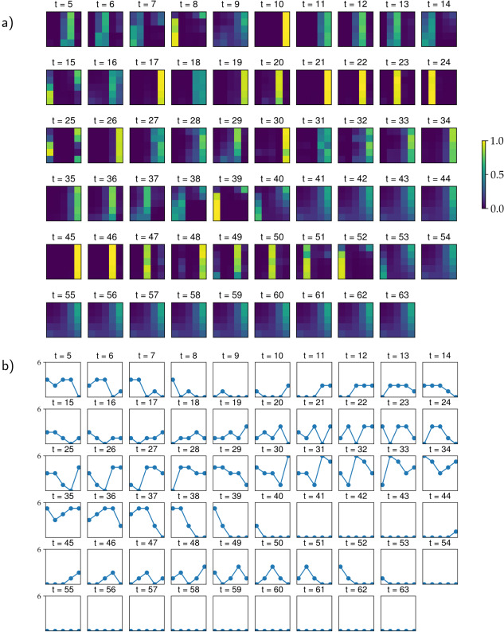

<a href="../#latest-news"><b>&lt;&lt;All News</b></a>

We are excited to share our latest accepted paper, a collaboration with esteemed colleagues from <b>Brown University</b>.

**Title:** **TransformerG2G - Adaptive Time-Stepping for Learning Temporal Graph Embeddings Using Transformers**  
**Authors:** **Alan John Varghese, Aniruddha Bora, Mengjia Xu\*, George Em Karniadakis**  
**Links:**  [Download paper](https://www.sciencedirect.com/science/article/abs/pii/S0893608023007475)| [GitHub Code](https://github.com/alanjohnvarghese/TransformerG2G) | <a href="#" id="bibtex" onclick="navigator.clipboard.writeText('@article{varghese2024transformerg2g,\n  title={TransformerG2G: Adaptive time-stepping for learning temporal graph embeddings using transformers},\n  author={Varghese, Alan John and Bora, Aniruddha and Xu, Mengjia and Karniadakis, George Em},\n  journal={Neural Networks},\n  volume={172},\n  pages={106086},\n  year={2024},\n  publisher={Elsevier}}'); alert('BibTex copied to clipboard!');">BibTex</a>

---

#### Overview

Dynamic graph embedding has become a powerful approach for tackling various temporal graph analytics tasks, such as link prediction, node classification, recommender systems, anomaly detection, and graph generation. These tasks require addressing challenges like transient dynamics, varying time intervals, and evolving node features. In this paper, we propose TransformerG2G, a novel graph embedding model with uncertainty quantification. By leveraging a transformer encoder, TransformerG2G captures long-range dependencies from historical graph contexts and generates multivariate Gaussian embeddings for nodes. Experiments on diverse benchmarks demonstrate that TransformerG2G outperforms traditional methods and our prior work (<a href ="https://ieeexplore.ieee.org/stamp/stamp.jsp?arnumber=9793727">DynG2G</a>) in link prediction accuracy and computational efficiency, particularly for graphs with high novelty (i.e., transient dynamics). Additionally, the model's attention weights provide interpretability, revealing temporal dependencies, adaptive time-stepping behavior, and key insights into graph evolution, such as the correlation between attention weights and node degree. These contributions enhance both the performance and explainability of dynamic graph embedding.

  

    
    
Fig. 1: Six different discrete-time temporal graph benchmarks along with their corresponding Temporal Edge Appearance (TEA) plots for effective characterization of evolutionary dynamics. (a)–(f) correspond to <b>SBM, Reality Mining, UCI, Bitcoin, Slashdot, and Autonomous Systems</b>, respectively. For each benchmark, the top row displays four distinct graph snapshots with the timestamp numbers, and the bottom row shows the TEA plot including the number of newly added edges (red bars) and the number of repeated edges (blue bars) over time. The index values corresponding to (a)–(f) are 0.0252, 0.0761, 0.7526, 0.9161, 0.9861, and 0.014, respectively.

  

  

    
    
Fig. 2: Illustration of our proposed TransformerG2G model architecture. The attention mechanism of the transformer enables the model to capture long-term context in the dynamics of the graph. The model’s input is the history of a node over several steps, from timestamps \(t_1\) to \(t_n\) and outputs the embedding vectors at timestamp \(t_n\) of that particular node. Here, the lookback \(l\) is a hyperparameter and different values of \(l\) are considered in our experiments.
    

  

  

    
    
Fig. 3: MAP values for temporal link prediction based on node embeddings learned with our proposed TransformerG2G model across six dynamic graph datasets, where higher MAP values indicate better link prediction performance. The datasets corresponding to (a)–(f) are SBM, Reality Mining, UCI, Bitcoin, Slashdot, and Autonomous Systems, respectively. The blue bars display the MAP values achieved by DynG2G, while the yellow bars present the MAP values obtained by our TransformerG2G model with different lookbacks \(l = 1,2,3,4,5\).
    

  

  

    
  

  

    
  

Fig. 4: The attention matrix of TransformerG2G for a randomly selected node (ID No. 6) in Reality Mining is visualized at different time stamps in (a). The attention matrix shows the importance given to the current state and previous context while generating the graph embeddings. (b) shows the node degree of the current state and previous context. Interestingly, we see that the learned model assigns more significance to time stamps where the node has a higher degree, indicating that the model recognized the importance of nodes with greater connectivity.

  

    <a href="../2023-9-21/">&lt;&lt;Previous News</a>
    <a href="../2024-05-11/">Next News&gt;&gt;</a>
  

