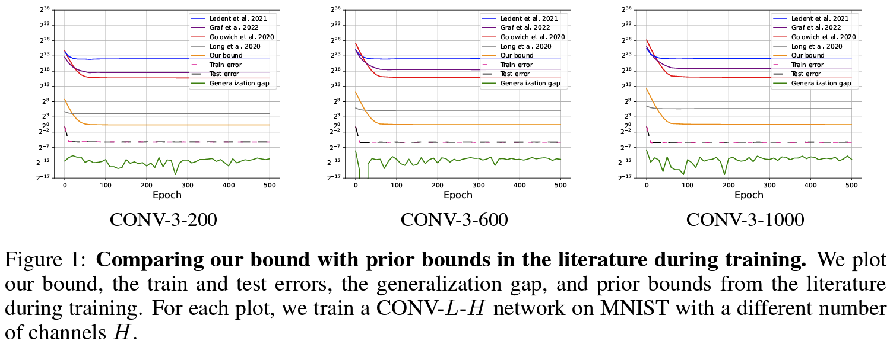
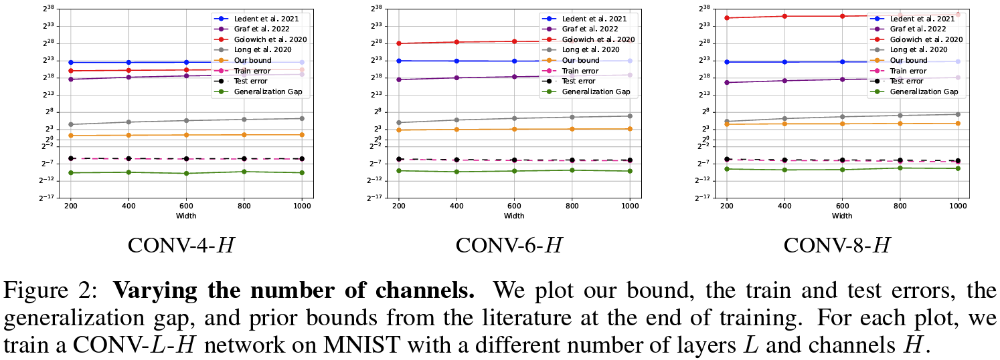
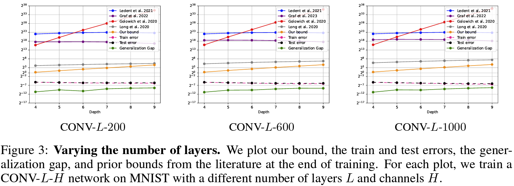

 
<a href="../#latest-news"><b>&lt;&lt;All News</b></a>

We are excited to share our latest accepted *NeurIPS* paper, a collaboration with esteemed colleagues from <b>MIT</b>.

**Title:** **Norm-Based Generalization Bounds for Compositionally Sparse Neural Networks**  
**Authors:** **Tomer Galanti, Mengjia Xu, Liane Galanti, Tomaso Poggio***  
**Links:** [Download paper](https://proceedings.neurips.cc/paper_files/paper/2023/file/8493e190ff1bbe3837eca821190b61ff-Paper-Conference.pdf) | <a href="#" id="bibtex" onclick="navigator.clipboard.writeText('@article{galanti2024norm, \n title={Norm-based generalization bounds for sparse neural networks}, \n author={Galanti, Tomer and Xu, Mengjia and Galanti, Liane and Poggio, Tomaso}, \n journal={Advances in Neural Information Processing Systems}, \n volume={36}, \n year={2024}}'); alert('BibTex copied to clipboard!');">BibTex</a>

#### Overview

In this work, we present new norm-based generalization bounds for compositionally sparse neural networks, such as convolutional networks. Our main contributions include deriving significantly tighter bounds for sparse networks without relying on weight sharing and demonstrating that good generalization can be achieved with weak dependence on network size. Our experiments confirm that these bounds outperform existing ones, emphasizing the importance of network architecture on test performance. 
<b>This work sheds light on why certain architectures excel, suggesting that sparsity is a key factor in their success</b>.

    
    
    
    

  

    <a href="../">&lt;&lt;Previous News</a>
    <a href="../2023-12-22/">Next News&gt;&gt;</a>
  

