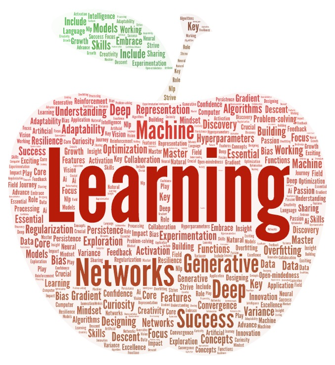
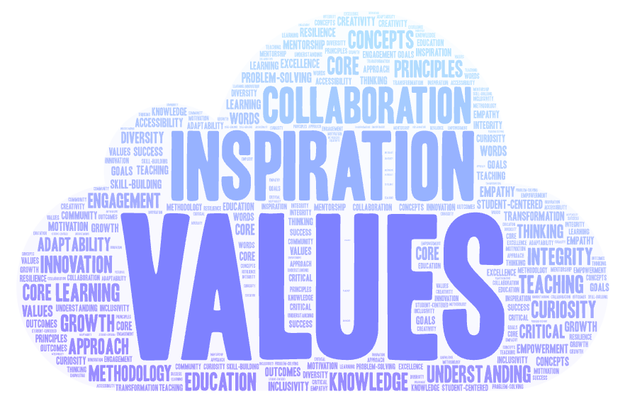

##### 🏆 New Course -- **Foundations and Applications of Graph Neural Networks** coming Fall 2025.

---
Fall 2024: [DS 677-005 - Deep Learning](course3/)

Spring 2024: [DS 677-002 - Deep Learning](course2/)

Fall 2023: [DS 675-005 - Introduction to Machine Learning](course1/)

**The Art of Teaching Philosophy** (figures created by [WordArt](https://wordart.com/create))

{: width="400px" height="auto" style="float: right; margin-left: 10px; margin-top: -125px;"}

{: width="500px" height="auto" style="float: right; margin-left: 10px; margin-top: -15px;"}

